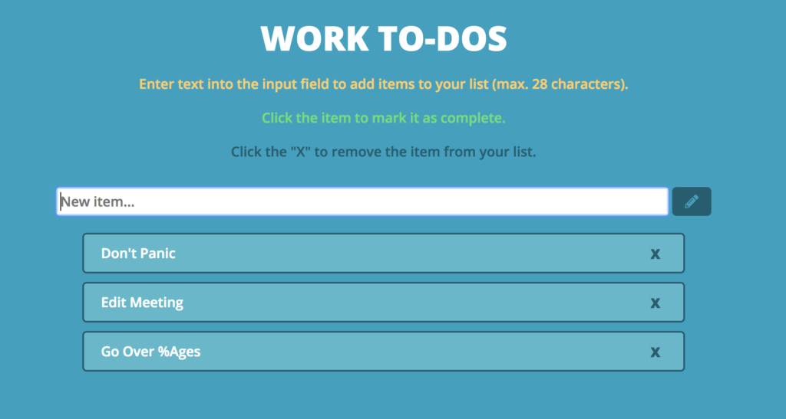

We are going to make a stylish To-Do list

This time you will not get the answers unless you try by yourself beforehand.

some links that will help you:
[Document.getElementById()](https://developer.mozilla.org/en-US/docs/Web/API/Document/getElementById)

[How to Create a To-do list W3](https://www.w3schools.com/howto/howto_js_todolist.asp)

lets start by creating three files:
```javascript
index.html
style.css
index.js
```

the html will be given to you, because we want to learn Javascript right now. so copy this cody to your index.html.

```html
</html>

<head>
    <meta charset="utf-8">
    <meta name="viewport" content="width=device-width, initial-scale=1, shrink-to-fit=no">
    <link rel="stylesheet" href="style.css">
    <title>To-do list</title>
</head>

<body>
    <div>
        <h1>Work To-Dos</h1>
        <div>
            <div>
                <p id="first">Enter text into the input field to add items to your list.</p>
                <p id="second">Click the item to mark it as complete.</p>
                <p id="third">Click the "X" to remove the item from your list.</p>
            </div>
        </div>
        <div>
            <div>
                <input id="userInput" type="text" placeholder="New item..." maxlength="27">
                <button id="enter"><i>Do it</i></button>
            </div>
        </div>
            <div>
                <ul>
                </ul>
            </div>
    </div>
    <script type="text/javascript" src="index.js"></script>
</body>

</html>
```

Now, Lets head to the Javascript!

if your having a hard time, and only if your having a hard time, look at the answer down the page:
.
.
.
.
.
.
.
.
.
.
.
.
.
.
.
.
.
.
||
\/
> ```javacsript
> const enterButton = document.getElementById("enter");
> const input = document.getElementById("userInput");
> const ul = document.querySelector("ul");
> const item = document.getElementsByTagName("li");
>
> function hasInput(){
>	return input.value.length > 0;
>} 
>
> function createListElement() {
>	const li = document.createElement("li");
>	li.appendChild(document.createTextNode(input.value));
>	ul.appendChild(li);
>	input.value = ""; 
>
>
>	function crossOut() {
>		li.classList.toggle("done");
>	}
>
>	li.addEventListener("click",crossOut);
>
>	const dBtn = document.createElement("button");
>	dBtn.appendChild(document.createTextNode("X"));
>	li.appendChild(dBtn);
>	dBtn.addEventListener("click", deleteListItem);
>
>	function deleteListItem(){
>		li.classList.add("delete")
>	}
>}
>
>
> function addListAfterClick(){
>	if (hasInput()) {
>		createListElement();
>	}
>}
>
> function addListAfterKeypress(event) {
>	if (hasInput() && event.which ===13) {
>		createListElement();
>	} 
> }
>
>
> enterButton.addEventListener("click",addListAfterClick);
>
> input.addEventListener("keypress", addListAfterKeypress);
> ```

I understand your having a hard time, thats ok!
go over this code and try to understand what it means.

As for the css, go crazy!

if you still want to take inspiration from the projects css, you can look down the page, *not recommended*
.
.
.
.
.
.
.
.
.
.
.
.
.
.
.
.
.
.
||
\/
> ```css
body {
    background-image: linear-gradient(90deg, rgba(165, 165, 165, 0.03) 0%, rgba(165, 165, 165, 0.03) 8%,rgba(235, 235, 235, 0.03) 8%, rgba(235, 235, 235, 0.03) 9%,rgba(7, 7, 7, 0.03) 9%, rgba(7, 7, 7, 0.03) 14%,rgba(212, 212, 212, 0.03) 14%, rgba(212, 212, 212, 0.03) 17%,rgba(219, 219, 219, 0.03) 17%, rgba(219, 219, 219, 0.03) 95%,rgba(86, 86, 86, 0.03) 95%, rgba(86, 86, 86, 0.03) 100%),linear-gradient(67.5deg, rgba(80, 80, 80, 0.03) 0%, rgba(80, 80, 80, 0.03) 11%,rgba(138, 138, 138, 0.03) 11%, rgba(138, 138, 138, 0.03) 17%,rgba(122, 122, 122, 0.03) 17%, rgba(122, 122, 122, 0.03) 24%,rgba(166, 166, 166, 0.03) 24%, rgba(166, 166, 166, 0.03) 27%,rgba(245, 245, 245, 0.03) 27%, rgba(245, 245, 245, 0.03) 89%,rgba(88, 88, 88, 0.03) 89%, rgba(88, 88, 88, 0.03) 100%),linear-gradient(67.5deg, rgba(244, 244, 244, 0.03) 0%, rgba(244, 244, 244, 0.03) 4%,rgba(16, 16, 16, 0.03) 4%, rgba(16, 16, 16, 0.03) 10%,rgba(157, 157, 157, 0.03) 10%, rgba(157, 157, 157, 0.03) 20%,rgba(212, 212, 212, 0.03) 20%, rgba(212, 212, 212, 0.03) 83%,rgba(5, 5, 5, 0.03) 83%, rgba(5, 5, 5, 0.03) 84%,rgba(237, 237, 237, 0.03) 84%, rgba(237, 237, 237, 0.03) 100%),linear-gradient(90deg, #ffffff,#ffffff);
    text-align: center;
	font-family: 'Open Sans', sans-serif;
}

.intro {
	margin: 30px 0px;
	font-weight: bold;
}

h1 {
	color: #4EB9CD;
	text-transform: uppercase;
	font-weight: 800;
}

p {
	font-weight: 600;
}

#first {
	margin-top: 10px;
	color: #0a0c1b;
}

#second {
	color: #0b193f;

}

#third {
	color: #022f36;
	margin-bottom: 30px;
}


#enter {
	border: none;
	padding: 5px 15px;
	border-radius: 5px;
	color: #04A1BF;
	background-color: #025F70;
	transition: all 0.75s ease;
	-webkit-transition: all 0.75s ease;
	-moz-transition: all 0.75s ease;
	-ms-transition: all 0.75s ease;
	-o-transition: all 0.75 ease;
	font-weight: normal;
}

#enter:hover{
	background-color: #02798F;
	color: #FFCD5D;
}

ul {
	text-align: left;
	margin-top: 20px;
}


li {
	list-style: none;
	padding: 10px 20px;
	color: #ffffff;
	text-transform: capitalize;
	font-weight: 600;
	border: 2px solid #025f70;
	border-radius: 5px;
	margin-bottom: 10px;
	background: #4EB9CD;
	transition: all 0.75s ease;
	-webkit-transition: all 0.5s ease;
	-moz-transition: all 0.5s ease;
	-ms-transition: all 0.5s ease;
	-o-transition: all 0.5 ease;
}

li:hover {
	background: #76CFE0;
}

li > button {
	font-weight: normal;
	background: none;
	border: none;
	float: right;
	color: #025f70;
	font-weight: 800;
}

input {
    border: dotted 1px black;
	border-radius: 5px;
	min-width: 65%;
	padding: 5px;
}


.done {
	background: #51DF70 !important;
	color: #00891E;
}

.delete {
	display: none;
 }
>```


And here you have it!